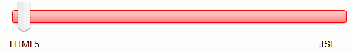

# 小学期一起爬
 小学期一起爬，爬，爬

----

## sticker-story: Creating HTML5 Pages in Jaavserver Faces 2.2 
Official tutorial: https://www.oracle.com/webfolder/technetwork/tutorials/obe/java/HTML5-JSF/html5jsf.html

stickers-1.html

stickers-2.xhtml

stickers-3.xhtml

stickers-4.xhtml

----

## JdbcConnectivity
JdbcConnectivity教程: https://www.yiibai.com/jsf/jdbc-connectivity.html
 
我们更新了JdbcConnectivity/User.java中的部分函数，可以采用Mysql8.0进行数据库通信，请按照原版的教程创建数据库，并且复制我们的User.java，和两个xhtml文件

 
 
 
 
 

----
## *我是华丽的分割线*
## *是NitrogenousFish闲的无聊在这里当日记用*
## *我们一起在这里爬啊爬，爬啊爬*~~
## *一起在小学期摸鱼*
----
 2019年8月29，STATUS：做不完PPT，写不完demo的我哈哈哈哈
 
先发现这个帖子的人可以找我拿月饼啊 0v0
 
是不会告诉你们我想不好给谁吃的嗷~ 0v0

------